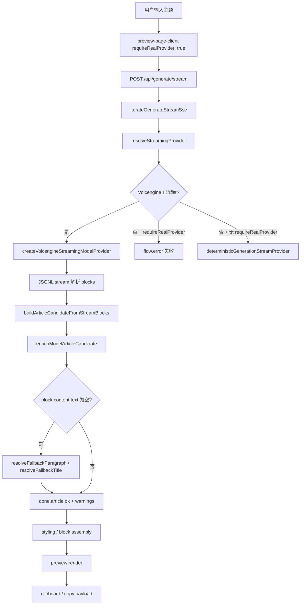

# P0-R1-BUG-001：Production 主链路偶发混入 Release 1 fallback 文案并重复拼接

> **诊断轮次：** P0-R1-BUG-001-DIAG · 2026-07-08
> **诊断状态：** **Accepted / Done**（PO 验收 2026-07-08）
> **修复轮次：** P0-R1-BUG-001-FIX · 2026-07-08
> **Bug 状态：** **Fix In Review** — 代码已修复，**待 PO 审查与 staging/production 验证**
> **修复状态：** **Fixed Pending Review**（未部署 · 未 merge sprint）

---

## 1. Bug 摘要

| 字段             | 内容                                                  |
| ---------------- | ----------------------------------------------------- |
| **Bug ID**       | P0-R1-BUG-001                                         |
| **严重级别**     | **P0 Closeout Blocker**                               |
| **发现时间**     | 2026-07-08（Release 1 Closeout 前 PO 人工主链路检查） |
| **所属 Release** | Release 1                                             |
| **阻塞**         | **Release 1 Closeout**                                |
| **Bug 状态**     | **Fix In Review / Fixed Pending Review**              |
| **诊断状态**     | **P0-R1-BUG-001-DIAG Accepted / Done**（2026-07-08）  |
| **修复状态**     | **Fixed Pending Review**（2026-07-08 · 未部署）       |

---

## 2. 用户复现描述

Product Owner 在 Release 1 Closeout 前检查生产主链路生成时，**一次**生成结果中出现明显内部占位 / fallback 文案：

```text
围绕「如何做好一个公众号」展开的 Release 1 生成正文。
```

用户输入主题为「如何做好一个公众号」。随后 PO **重试两次**，生成结果均正常。

**判断：** 间歇性问题；但即使偶发，也不允许用户看到含 “Release 1 生成正文” 的内部占位文案。

---

## 3. 后续两次正常生成

- 同一主题、同一环境、短时间内重试 **2 次** 均得到正常模型正文。
- 说明问题**非稳定复现**，与单次请求的模型输出形态或流式解析结果相关，而非固定配置错误。

---

## 4. 影响范围判断

| 维度             | 判断                                                                                                                                                                     |
| ---------------- | ------------------------------------------------------------------------------------------------------------------------------------------------------------------------ |
| **环境**         | **代码路径通用** — staging 与 production 共用同一 enrichment 与 Volcengine 流式链路；非 production-only                                                                  |
| **Provider**     | Production 预览主链路 `requireRealProvider: true`，使用 Volcengine 真实模型；**非** mock provider 误配                                                                   |
| **Release 分支** | `origin/release/1` 与 `sprint/s12-product-governance-r2-planning` 在 `src/`、`app/`、`lib/`、`components/`、`tests/` **无产品代码 diff** — 属 **Release 1 当前代码问题** |
| **用户可见面**   | 预览、复制 payload、剪贴板导出均基于 enrichment 后的 Article blocks，占位文案可直达用户                                                                                  |

---

## 5. 搜索命中结果

### 5.1 精确文案命中（产品代码）

| 文件                                              | 行  | 文案                                          | 用途                                                                                     |
| ------------------------------------------------- | --- | --------------------------------------------- | ---------------------------------------------------------------------------------------- |
| `src/core/generation/model-article-enrichment.ts` | 136 | `围绕「${topic}」展开的 Release 1 生成正文。` | **`resolveFallbackParagraph()`** — 模型 block `content.text` 为空时 enrichment 补齐      |
| `src/core/generation/test-provider.ts`            | 32  | `围绕「${title}」展开的 Release 1 示例正文。` | 确定性 **dev stream** provider；production 预览 `requireRealProvider: true` 时不走此路径 |

### 5.2 相关关键词命中摘要

- **fallback / enrichment：** `model-article-enrichment.ts` 中 `resolveFallbackTitle`、`resolveFallbackParagraph`、`coercePlainText`、`createMinimalBlocks`
- **provider：** `run-generate-stream-flow.ts` → `resolveStreamingProvider`；Volcengine 配置缺失且 `requireRealProvider` 时返回 null（失败），否则 deterministic dev provider
- **stream / SSE：** `volcengine-streaming-provider.ts` → JSONL parser → `enrichModelArticleCandidate` → `done.article`
- **测试：** `tests/core/generation/model-article-enrichment.test.ts` — `"fills title and paragraph content minimally"` 仅断言 truthy，**未禁止**内部占位字符串

### 5.3 未命中

- `prisma/`、环境变量默认值、部署脚本中**无** “Release 1 生成正文” 字符串
- Renderer / copy 层**无**该文案；泄漏点在 **generation enrichment**，下游原样渲染

---

## 6. 相关代码路径（调用链）



**泄漏点：** `enrichModelArticleCandidate` → `enrichBlockContent` → `coercePlainText(content.text, context.paragraph)`，其中 `context.paragraph` 来自 `resolveFallbackParagraph()`。

关键代码：

```128:138:src/core/generation/model-article-enrichment.ts
function resolveFallbackParagraph(input: NormalizedInput): string {
  if (input.draft && input.draft.trim().length > 0) {
    return input.draft.trim();
  }
  if (input.materials.length > 0) {
    return input.materials.map((source) => source.text).join("\n\n");
  }
  if (input.topic && input.topic.trim().length > 0) {
    return `围绕「${input.topic.trim()}」展开的 Release 1 生成正文。`;
  }
  return "这是一段由模型 enrichment 补齐的默认正文。";
}
```

Volcengine 流式完成后 enrichment **不因 warnings 失败**：

```134:166:src/core/generation/volcengine-streaming-provider.ts
      const enrichment = enrichModelArticleCandidate({ ... });

      if (!enrichment.ok) {
        yield createProviderErrorEvent(...);
        return;
      }

      yield {
        type: "done.article",
        ...
        meta: {
          enrichmentWarningCount: enrichment.warnings.length,
          ...
        },
      };
```

`enrichmentWarningCount` 仅写入 `done.article` meta，**未**在 SSE/UI 层阻断成功态或提示用户。

---

## 7. 可能原因排序

| 排序  | 假设                                                                                | 可能性     | 说明                                                                                          |
| ----- | ----------------------------------------------------------------------------------- | ---------- | --------------------------------------------------------------------------------------------- |
| **1** | 真实 Volcengine 流式输出中部分 block 结构合法但 `content.text` 为空 / 仅空白 / 缺失 | **最高**   | enrichment 静默补齐为 “Release 1 生成正文” 占位句；流仍 `done.article` 成功                   |
| **2** | JSONL 行级解析在边界 chunk 下产出 `content: {}` 的 complete block                   | **高**     | `jsonl-block-stream-parser.ts` 对无法解析的 content 默认为 `{}`                               |
| **3** | 模型与真实正文混排：部分 block 有正文、部分 block 被 fallback 填充                  | **高**     | 解释 PO 看到「正常结构 + 一句内部占位」的混合结果                                             |
| **4** | `metadata.title` + `title` block + `heading` block 均 fallback 到同一 topic         | **高**     | 解释重复标题 / 重复段落观感                                                                   |
| **5** | Production 误用 deterministic test provider                                         | **低**     | `preview-page-client` 传 `requireRealProvider: true`；无 Volcengine 配置时应直接失败而非 mock |
| **6** | SSE 先写 mock block 再追加真实 block                                                | **低**     | 流式路径为增量 `block.delta` + 最终单次 enrichment；无 mock→real 拼接逻辑                     |
| **7** | dev fixture 被 production 引用                                                      | **无证据** | fixture 文案为「如何提高团队执行力」，与 PO 案例主题不同                                      |

---

## 8. 最可能根因

**真实 Volcengine provider 在间歇性请求中返回了含空 `content.text` 的 block（或流式 JSONL 解析得到空 content），`enrichModelArticleCandidate` 将其静默补齐为含 “Release 1 生成正文” 的内部开发占位句，且 enrichment warnings 不阻断 `done.article` 成功事件，用户看到「生成成功」的混合正文。**

间歇性源于：**并非每次模型输出都缺 text**；重试时模型返回完整 text 即正常。

---

## 9. 重复标题 / 重复段落机制

当多个 block 的 `content.text` 同时为空时，enrichment 使用**同一** `context`：

| Block 类型        | Fallback 来源                             | PO 案例下可见结果                                       |
| ----------------- | ----------------------------------------- | ------------------------------------------------------- |
| `metadata.title`  | `resolveFallbackTitle` → topic            | 「如何做好一个公众号」                                  |
| `title` block     | `coercePlainText(..., context.title)`     | 同上                                                    |
| `heading` block   | `coercePlainText(..., context.title)`     | 同上（重复标题感）                                      |
| `paragraph` block | `coercePlainText(..., context.paragraph)` | `围绕「如何做好一个公众号」展开的 Release 1 生成正文。` |

若模型另返回带正文的 paragraph，则用户可见 **真实段落 + fallback 段落** 或 **topic 作标题多次出现**。

`createMinimalBlocks()` 在 `blocks` 数组为空时也会生成 title + paragraph 双 fallback，但 Volcengine 路径通常有 blocks；PO 案例更符合 **部分 block 空 text** 而非全空 blocks。

---

## 10. 不能接受的产品表现

1. 任何 production / staging 用户可见正文中出现 “Release 1 生成正文” 或类似内部 sprint 占位语。
2. 真实 provider 输出不完整时，系统**静默**以 fallback 冒充成功文章。
3. enrichment warnings 存在但用户无感知、无重试引导。
4. 同一主题在 title / heading / paragraph 多层重复拼接。

---

## 11. 建议修复方向（本轮不实施）

1. **删除或替换** `resolveFallbackParagraph` / 相关 fallback 中的 Release 1 内部文案；dev-only 文案不得进入 production enrichment 路径。
2. **真实 provider 模式：** 当 `requireRealProvider === true` 且任一正文类 block 需 fallback 补齐时，应 **fail fast**（`invalid_article_candidate` / 明确错误 SSE），而非 `ok: true`。
3. **Warnings 升格：** `enrichmentWarningCount > 0` 且含 `*_fallback` 类 warning 时，客户端展示失败或「生成不完整，请重试」，禁止进入 copy-ready 态。
4. **回归测试：** 断言 production 路径输出不得包含 `/Release 1 生成正文|Release 1 示例正文/`。
5. **可选：** 区分 dev enrichment fallback 与 production strict mode（环境或 `requireRealProvider` 门控）。

---

## 12. 建议验收标准

1. 任何 production 用户可见结果中**不得**出现 “Release 1 生成正文” 或类似内部占位文案。
2. 真实 provider 失败或输出不完整时，**不得**静默返回 mock/fallback 成功文章。
3. fallback 如仍存在（仅 dev），必须是开发者可识别语境，且**不可**进入 `requireRealProvider` 路径。
4. 同一标题 / 同一段 fallback **不得**因 enrichment 重复拼接至用户可见输出。
5. staging 与 production 均需验证（同一代码路径）。
6. 为占位文案泄漏增加 **regression test**（enrichment + volcengine-streaming 集成层）。

---

## 13. 是否阻塞 Release 1 Closeout

**是。** P0 Closeout Blocker — 主链路可向真实用户（含 Prelaunch PO）暴露内部开发占位文案，且表现为成功生成。

---

## 14. 是否建议立即修复

**是。** 修复面小（ primarily `model-article-enrichment.ts` 策略 + provider 门控 + 测试），但须在独立 `bugfix/` 分支经 PO 授权后执行；**本轮仅诊断**。

---

## 15. 仍需确认的问题

1. **生产日志：** 事发请求是否记录 `enrichmentWarningCount > 0`？（需运维/日志权限，本轮未查生产日志。）
2. **模型原始输出：** 事发时 Volcengine 返回的 JSONL 是否含空 `text` 字段？（需 requestId 级 trace 或复现抓包。）
3. **重复块范围：** PO 是否同时看到重复 title block 与 heading，还是仅 paragraph 占位句？（影响验收用例粒度。）
4. **非 topic_only 模式：** `draft_rewrite` / `topic_with_materials` 路径下 fallback 文案不同，是否也需纳入修复验收？

---

## 16. 分支与代码基线

| 项                        | 值                                                        |
| ------------------------- | --------------------------------------------------------- |
| 诊断分支                  | `diagnosis/p0-r1-bug-001-generation-fallback-placeholder` |
| 来源分支                  | `sprint/s12-product-governance-r2-planning` @ `6d7d8a2`   |
| `release/1` 产品代码 diff | **无**（docs-only 差异）                                  |

---

## 17. 参考测试执行（诊断轮）

| 命令                                 | 结果                             |
| ------------------------------------ | -------------------------------- |
| `pnpm test generate`                 | 2 files, 2 tests passed          |
| `pnpm test model-article-enrichment` | 1 file, 18 tests passed          |
| `pnpm test volcengine-streaming`     | 1 file, 1 test passed            |
| `pnpm test test-provider`            | No test files found              |
| `pnpm test fallback`                 | 未单独命中（无 dedicated suite） |

**缺口：** 无 regression test 禁止 “Release 1 生成正文” 泄漏至用户可见 enrichment 输出。

---

## 18. PO 验收记录（P0-R1-BUG-001-DIAG）

**P0-R1-BUG-001-DIAG Accepted / Done**（2026-07-08）

PO accepted the diagnosis of P0-R1-BUG-001. The diagnosis confirmed that user-visible “Release 1 生成正文” placeholder leakage originates from `model-article-enrichment` fallback behavior when real-provider blocks contain empty or missing `content.text`.

This acceptance closes the diagnosis only. **P0-R1-BUG-001 remains Open / Blocking / To Fix.** Release 1 Closeout remains blocked pending bugfix and verification.

No product code changes. No bugfix started. No Release 1 closeout. No merge to `release/1`. No merge to `main`. No push. No Release 2 start. No R2 Sprint start.

---

## 19. 修复记录（P0-R1-BUG-001-FIX · 2026-07-08 · In Review）

**策略：** 新增 `strictContent` enrichment 选项；Volcengine real provider 路径启用 `strictContent: true`；缺失用户可见 block text 时产出 blocking error（`missing_required_block_text` / `missing_blocks`），不再静默补正文；移除 `resolveFallbackParagraph` 中 “Release 1 生成正文” 内部文案；dev deterministic provider 改用中性示例段落。

**状态：** Fix In Review · Fixed Pending Review · **未部署** · **未 merge sprint** · Release 1 Closeout **仍阻塞** pending PO 审查与 staging/production 人工验证。
