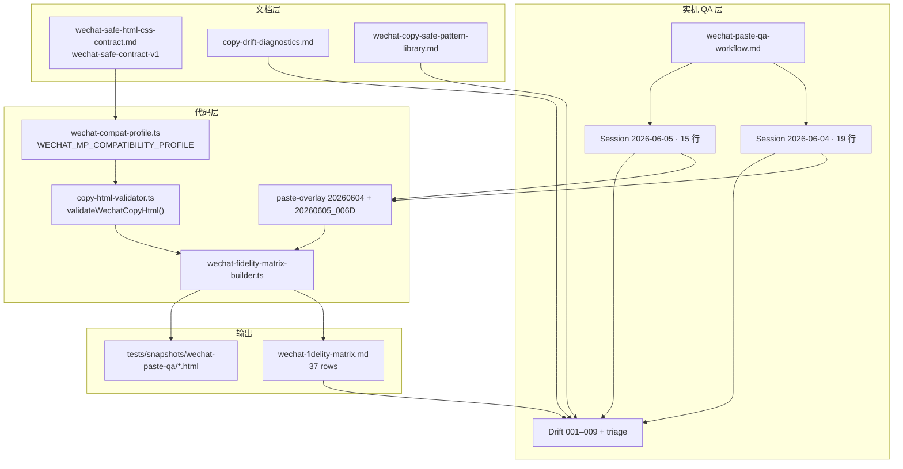

# Sprint 8 Contract & Fidelity Audit

> 轻篇公众号排版 · qingpian-wechat-editor  
> **Story：** S8-STORY-009 · Contract Audit / Closeout  
> **日期：** 2026-06-05  
> **Contract：** `wechat-safe-contract-v1` · **Profile：** `wechat-mp-editor-v1`

---

## 1. Audit 结论

| 项 | 值 |
|----|-----|
| **Grade** | **A-** |
| **P0** | **0** |
| **P1** | **4** |
| **P2** | **3** |
| **建议进入 S8 Close Readiness** | **是** |
| **建议关闭 Sprint 8** | **建议用户审查确认后关闭**；Cursor 本轮**不关闭** |
| **建议 merge `sprint/s8-wechat-safe-css-contract` → `release/1`** | **是（须用户确认）**；本轮**不执行 merge** |
| **是否 merge `main`** | **否** |

**摘要：** Sprint 8 已交付 WeChat-safe Contract v1、Compatibility Profile、Copy HTML Validator、Fidelity Matrix（37 行）、Paste QA 流程与 Drift 诊断体系，并完成 006C 共性修复、006D 复测、HEAD-002 审计、DRIFT-003 产品澄清与 S9 规划重排。**无 P0 阻塞 S8 收口。**

---

## 2. Audit 范围

### 2.1 Story 覆盖

| Story | 名称 | 状态 | 审计结论 |
|-------|------|------|----------|
| S8-STORY-001 | 竞品调研 + Sprint 初始化 | Done | PASS — 调研骨架与 sprint 初始化到位 |
| S8-STORY-002 | Contract v1 文档 | Done | PASS — `wechat-safe-contract-v1` · DECISION-089 |
| S8-STORY-003 | Compatibility Profile | Done | PASS — `src/core/wechat-compat/wechat-compat-profile.ts` |
| S8-STORY-004 | Copy HTML Validator | Done | PASS — `copy-html-validator.ts` + 测试 |
| S8-STORY-005 | Fixture + Fidelity Matrix | Done | PASS — 37 行 · 10 类控件 |
| S8-STORY-006 | Paste QA 流程 | Done | PASS — workflow · session · drift |
| S8-STORY-006B | 样式调研 + Drift triage | Done | PASS — pattern library · triage |
| S8-STORY-006B-FIX-A | Article evidence 工作流 | Done | PASS |
| S8-STORY-006B-FIX-B | 批量补 article evidence | Planned | **非阻塞** · P1 遗留 |
| S8-STORY-006C | Copy-safe renderer 修复 | Done | PASS — 8 Drift resolved by 006D |
| S8-STORY-006D | Matrix 回归 + 复测 | Done | PASS — 15/15 PO PASS |
| S8-STORY-007 | HEAD-002 审计 | Done | PASS — validator false positive · no S8 code change |
| S8-STORY-008 | S9 重排 | Done | PASS — DECISION-092 |
| S8-DRIFT-003 | 产品澄清 | Done | PASS — 不阻塞 closeout |
| S8-STORY-009 | 本审计 | **In Review** | 本轮交付 |

### 2.2 代码与测试审查范围

| 路径 | 角色 |
|------|------|
| `src/core/wechat-compat/` | Contract profile · validator · waivers · matrix types |
| `src/core/copy/` | Copy Renderer 产物（Matrix fixture 输入） |
| `tests/core/wechat-compat/` | Profile · validator · matrix 测试 |
| `tests/snapshots/wechat-paste-qa/` | Paste QA Copy HTML 快照 |
| `tests/support/wechat-fidelity-matrix-*.ts` | Matrix 生成与 overlay |

**本轮未改业务代码** — 审计与 closeout 文档 only。

---

## 3. Contract ↔ Profile ↔ Validator ↔ Matrix ↔ Paste QA 链路

| 链路节点 | 状态 | 证据 |
|----------|------|------|
| Contract v1 文档 ↔ Profile | **对齐** | DECISION-089/090 · `contractVersionId` |
| Profile ↔ Validator | **对齐** | validator 消费 profile 分级 · 861 tests PASS |
| Validator ↔ Matrix | **对齐** | 每行 `validatorStatus` 由 `validateWechatCopyHtml` 生成 |
| Matrix ↔ Paste overlay | **对齐** | `S8_FIDELITY_PASTE_QA_OVERLAY_20260604` + `20260605_006D` |
| Paste Session ↔ Drift | **对齐** | 9 Drift 记录 · 8 resolved · 003 closed |
| Pattern Library ↔ 006C | **对齐** | copy-safe-card · left-border · title-divider |

**已知分叉（已登记、非 P0）：**

| 分叉 | 处理 |
|------|------|
| Validator FAIL · Paste PASS（HEAD-002 等） | S8-STORY-007 审计 · catalog 遗留 → S9 metadata / post-S8 validator |
| Validator WARNING 普遍 · Paste PASS | Yellow tag/CSS 预期行为 · waiver 有 evidence 时标注 |
| Matrix UNTESTED 16 行 | 非 S8 P0；Release 1 / S9 / 后续 Paste QA 扩展 |

---

## 4. Fidelity Matrix 审计

| 指标 | 值 |
|------|-----|
| 总行数 | 37 |
| 控件覆盖 | 10 类（title · heading · paragraph · lead · list · quote · summary · info_card · cta · divider） |
| Validator | PASS 0 · WARNING 33 · FAIL 4 |
| Paste（已测 21 行） | PASS 20 · WARNING 1 · FAIL 0 |
| Paste UNTESTED | 16 |
| 006D | Re-test 8/8 · Harvest 2/2 · Control 5/5 |

### 4.1 Validator FAIL 行（4）

| matrixRowId | variantId | pasteStatus | S8 处置 |
|-------------|-----------|-------------|---------|
| S8M-TITLE-002 | `title_left_bar_classic` | PASS | 006C resolved · candidate 未入 default preset |
| S8M-HEAD-002 | `heading_numbered_section` | PASS | 007：validator false positive · no S8 code change |
| S8M-HEAD-004 | `heading_card_centered` | PASS | 006C resolved |
| S8M-LEAD-003 | `lead_quote_intro` | PASS | 006C resolved |

**结论：** 4 行均为 **Paste PASS**；无「实机 FAIL 未修复」遗留。

### 4.2 Paste WARNING 行（1 · 已澄清）

| matrixRowId | 处置 |
|-------------|------|
| S8M-TITLE-001 | DRIFT-003 **CLOSED** · PRODUCT_EXPECTATION_CLARIFIED · 非 renderer bug |

### 4.3 Harvest candidates（S9 seed）

| matrixRowId | pasteStatus | 约束 |
|-------------|-------------|------|
| S8M-HARVEST-001 | PASS | candidate-paste-pass · **不**直接 user-selectable |
| S8M-HARVEST-002 | PASS | 同上 · DECISION-092 |

---

## 5. Drift 收口

| Drift | matrixRowId | 006D 后状态 |
|-------|-------------|-------------|
| 001 | S8M-TITLE-002 | **RESOLVED** · 006D PASS |
| 002 | S8M-TITLE-003 | **RESOLVED** · 006D PASS |
| 003 | S8M-TITLE-001 | **CLOSED** · 产品澄清 |
| 004 | S8M-CARD-001 | **RESOLVED** · 006D PASS |
| 005 | S8M-PARA-004 | **RESOLVED** · 006D PASS |
| 006 | S8M-SUM-004 | **RESOLVED** · 006D PASS |
| 007 | S8M-CARD-004 | **RESOLVED** · 006D PASS |
| 008 | S8M-HEAD-004 | **RESOLVED** · 006D PASS |
| 009 | S8M-LEAD-003 | **RESOLVED** · 006D PASS |

**开放 Drift：0**

---

## 6. P1 / P2 遗留（不阻塞 S8 closeout）

### P1

| ID | 问题 | 建议归属 |
|----|------|----------|
| **P1-S8-001** | Matrix 16 行 Paste UNTESTED | Release 1 hardening / S9 lifecycle QA |
| **P1-S8-002** | Validator catalog 缺口（如 `font-variant-numeric`） | post-S8 validator · S9 compatibility metadata |
| **P1-S8-003** | S8-STORY-006B-FIX-B 批量 article evidence | S8 非阻塞 · 可增强 harvest 输入 |
| **P1-S8-004** | `title_left_bar_classic` validator 仍 FAIL（paste PASS） | S9 promote 前再跑 validator/catalog 对齐 |

### P2

| ID | 问题 | 建议归属 |
|----|------|----------|
| **P2-S10-001** | title/cardTitle paste QA rubric 分级 | Sprint 10（DRIFT-003 衍生） |
| **P2-S10-002** | 更强 WeChat-safe cardTitle variants | Sprint 10 |
| **P2-S4A-001** | Style Gallery 人工视觉验收入口 | Sprint 6/Release 2 遗留 |

---

## 7. Release 1 关闭 vs Sprint 8 关闭（分离说明）

| 维度 | Sprint 8 关闭 | Release 1 关闭 |
|------|---------------|----------------|
| **定义** | WeChat Fidelity 体系交付 + audit 通过 + sprint merge `release/1` | 用户可见 9 条关闭标准（`release-plan.md` §关闭前置条件） |
| **本轮关系** | S8-STORY-009 完成 audit → **建议** merge sprint → `release/1` | **不等于** Release 1 自动关闭 |
| **粘贴 QA** | 21/37 Matrix 行已 PO 实机 · Drift 闭环 | 须「核心样式基本一致」+ 手动 QA 记录 — S8 提供体系，**未宣称** 全量 33 variant 已 Paste PASS |
| **Sprint 9** | DECISION-092 规划完成 · 待 S8 merge 后启动 | S9 不阻塞 Release 1 关闭决策，但属 Release 1 尾声路线 |
| **merge `main`** | **不在 S8 范围** | Release 1 整体验收后才 merge |

---

## 8. Sprint 9 启动条件清单

S8 merge `release/1` 后，满足以下即可启动 `sprint/s9-style-management-system-v0`：

| # | 条件 | S8 状态 |
|---|------|---------|
| 1 | Contract v1 + Profile + Validator 可运行 | **满足** |
| 2 | Fidelity Matrix + Paste QA 流程可复用 | **满足** |
| 3 | Drift / Pattern Library / triage 文档 | **满足** |
| 4 | Harvest seed assets（006D 两 candidate） | **满足** · `WX-HARVEST-EVIDENCE-001` |
| 5 | DECISION-092 领域模型与 story map | **满足** · `sprint9-style-management-system-v0.md` |
| 6 | S8 不扩展后台（边界清晰） | **满足** · DECISION-088/092 |
| 7 | Sprint 8 audit 报告 | **本轮** · 本文档 |

**不在 S9 启动前必须完成：** 006B-FIX-B · Matrix 全量 Paste · validator catalog 补全。

---

## 9. S8 Close Readiness 检查表

| # | 项 | 状态 |
|---|-----|------|
| 1 | Contract 文档定稿（002） | **Done** |
| 2 | Profile + Validator 可运行（003、004） | **Done** |
| 3 | Matrix 10 类控件 ≥30 行（005） | **Done** · 37 行 |
| 4 | Paste QA 流程与模板（006） | **Done** |
| 5 | 006C/006D Copy-safe 修复与复测 | **Done** |
| 6 | HEAD-002 审计（007） | **Done** |
| 7 | DRIFT-003 澄清 | **Done** |
| 8 | S9 规划（008） | **Done** |
| 9 | 本 audit 报告（009） | **Done（In Review）** |
| 10 | merge sprint → `release/1` | **待用户确认** |
| 11 | Sprint 8 用户确认关闭 | **待用户确认** |

---

## 10. 建议下一步

1. **用户 / ChatGPT 审查**本 audit 与 execution report。
2. 审查通过后：**merge** `sprint/s8-wechat-safe-css-contract` → `release/1`（`--no-ff` · 用户确认）。
3. 用户确认 **Sprint 8 Closed**（Cursor 不自行宣布）。
4. 从 `release/1` 切 `sprint/s9-style-management-system-v0` 启动 Sprint 9。
5. **不 merge `main`** 直至 Release 1 整体验收。

---

## 11. 相关文档

| 文档 | 路径 |
|------|------|
| Sprint 8 总览 | [`docs/agile/sprint8-wechat-safe-css-contract.md`](../../agile/sprint8-wechat-safe-css-contract.md) |
| Fidelity Matrix | [`docs/agile/paste-qa/wechat-fidelity-matrix.md`](../../agile/paste-qa/wechat-fidelity-matrix.md) |
| HEAD-002 审计 | [`s8-story-007-head-002-preview-copy-validator-audit.md`](s8-story-007-head-002-preview-copy-validator-audit.md) |
| DRIFT-003 | [`docs/agile/paste-qa/drift/DRIFT-S8-20260604-003.md`](../../agile/paste-qa/drift/DRIFT-S8-20260604-003.md) |
| Sprint 9 规划 | [`docs/agile/sprint9-style-management-system-v0.md`](../../agile/sprint9-style-management-system-v0.md) |
| Release 1 关闭标准 | [`docs/agile/release-plan.md`](../../agile/release-plan.md) |
