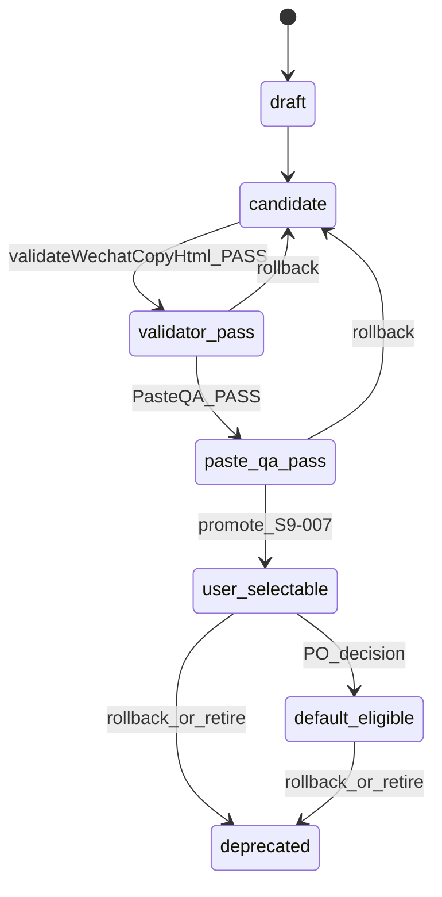

# Style Management Domain Model

> 轻篇公众号排版 · qingpian-wechat-editor  
> **Sprint 9 · S9-STORY-001** · Style Management System v0  
> **状态：** 正式领域模型（文档层） · **DECISION-094**  
> **关联：** [`style-system.md`](style-system.md) · [`wechat-copy-style-rules.md`](wechat-copy-style-rules.md) · [`sprint9-style-management-system-v0.md`](../agile/sprint9-style-management-system-v0.md) · **DECISION-092**

---

## 1. 领域边界

### 1.1 S9 Style Management System v0 是什么

S9 Style Management System v0（样式管理后台 v0）是轻篇**主项目内**的样式资产**治理层**，负责：

- 样式资产 metadata 与 lifecycle 管理
- QA evidence 收集与 promote / rollback 决策边界
- 从新增 → 验证 → 上线 → 用户侧分发的**概念闭环**

它**不是**：

- 第二套 StyleRegistry 或 Renderer
- 独立仓库 / 独立部署 / 数据库后台
- 用户侧样式市场或权限审批系统

### 1.2 与运行时的关系

```text
Style Management（S9 治理层）
  ├── metadata · lifecycle · QA evidence · promote/rollback 决策
  └── file-backed 资产（S9-STORY-002 起）

Style System（运行时 · 不变更加载路径直至 promote）
  ├── StyleRegistry（themes · presets · variants）
  ├── StyleResolver → ResolvedBlockStyle
  ├── Preview Renderer / Copy Renderer
  └── validateWechatCopyHtml + WECHAT_MP_COMPATIBILITY_PROFILE
```

**S9-STORY-001 范围：** 仅定义上述治理层概念与边界。**不**实现 UI、file storage、registry 加载变更或用户侧 variant 新增。

### 1.3 与 style-system.md 的关系

| 文档 | 层级 | 职责 |
|------|------|------|
| [`style-system.md`](style-system.md) | 运行时技术方案 | VariantDefinition · PresetDefinition · StyleResolver · Renderer 契约 |
| **本文档** | 治理扩展层 | lifecycle · QA evidence · user_selectable · promote/rollback · harvest 入库路径 |

Preview / Copy **仍只消费** `ResolvedBlockStyle`；治理层不直接向 Renderer 注入 HTML。

---

## 2. 核心实体定义

### 2.1 Style（样式）

**定义：** 面向产品/运营的整篇视觉风格顶层概念，通常由 **Theme + Preset** 组合表达，可附带 palette 与 selection rule 引用。

| 属性（治理层） | 说明 |
|----------------|------|
| `styleId` | 治理层唯一 ID（可与 presetId 对齐或作为组合键） |
| `themeId` | 关联 Theme |
| `presetId` | 关联 Preset |
| `label` / `description` | 运营可读名称 |
| `lifecycle` | 整包级状态（通常跟随 preset 默认 variant 池） |

**代码映射：** `ThemeDefinition` + `PresetDefinition`（[`src/core/styles/types.ts`](../../src/core/styles/types.ts)）

### 2.2 Style Family（样式族）

**定义：** 同一视觉语言下的 variant 分组，用于编排去重（如 StyleOrchestrator R8）与 harvest 分类。

| 示例 | 用途 |
|------|------|
| `classicNews` | first-wave 33 variants |
| `harvestCandidate` | S8-STORY-006C/006D harvest 候选 |
| heading publish pool families | S7-STORY-008 发布池 |

**代码映射：** `VariantDefinition.family` · `VariantComponentProtocol.familyId`

### 2.3 Palette（配色包）

**定义：** 一组可切换的色 token 集合，供用户侧「风格 / 配色」切换与 theme 引用。

| 属性 | 说明 |
|------|------|
| `paletteId` | 唯一 ID |
| `tokens` | 色值 token map（如 primary · accent · surface） |
| `compatibleThemeIds` | 可搭配的 theme 列表 |

**代码映射：** `ThemeDefinition` 内色 token；S6 用户侧 palette 切换 UI 消费 theme 子集。

**S9 v0：** palette 作为 style library 一等资产治理；S9-STORY-008 实现最小管理能力。

### 2.4 Variant（变体）

**定义：** 某 `blockType × variantId` 的可注册样式定义，含 slots · tokens · compatibility · componentProtocol。

| 属性 | 说明 |
|------|------|
| `id` | variantId |
| `blockType` | Block.type |
| `family` | Style Family |
| `status` | 代码层 `VariantStatus`（见 §4.2） |
| `lifecycle` | 治理层 lifecycle 状态（见 §4.1） |
| `compatibility` | copySafety · wechat metadata |

**代码映射：** `VariantDefinition` · 注册于 `StyleRegistry.variants`

**运行时 registry：** [`createFirstWaveRequiredVariantRegistry()`](../../src/core/styles/variants/index.ts) 聚合 first-wave 33 variants；harvest candidates 在独立模块，**不在**默认 registry。

### 2.5 Preset（风格包）

**定义：** 整篇文章的默认样式包：theme 引用、密度、block 默认 variant、可选 variant pool。

| 属性 | 说明 |
|------|------|
| `presetId` | 唯一 ID |
| `themeId` | 默认 theme |
| `defaultVariantByBlockType` | 各 block 默认 variant |
| `variantPoolsByBlockType` | Gallery / AI 可选 variant 池 |

**代码映射：** `PresetDefinition` · `buildMiaopianPresetDefinitions()`

**default preset 边界：** 仅 `default_eligible` 或 `release1_required` variant 可进入 `defaultVariantByBlockType`；candidate / 仅 `user_selectable` 不得默认选中。

### 2.6 Copy-safe Rule（复制安全规则）

**定义：** 约束 variant / slot 在 Copy Renderer 输出与公众号粘贴中的安全边界。

| 层级 | 内容 |
|------|------|
| Variant 级 | `compatibility.copySafety`: `strict` \| `balanced` \| `preview_only` |
| Slot 级 | `SlotCopySafety`: `allowedInCopy` · `copySafety` · fallback |
| Pattern 级 | [`wechat-copy-safe-pattern-library.md`](wechat-copy-safe-pattern-library.md) 登记的可复用 copy-safe 模式 |
| Contract 级 | WeChat-safe Contract v1 Green / Yellow / Red |

**代码映射：** `SlotCopySafety` · `validateVariantForWechatCopy` · `validateWechatCopyHtml`

**release1_required 硬约束：** active slot 不得 `preview_only`；须 `allowedInCopy=true`（disabled slot 除外）。

### 2.7 Style Selection Rule（样式选择规则）

**定义：** AI 样式建议与用户侧 variant 选择的编排规则，确保不绕过 Style System validation。

| 规则 | 说明 |
|------|------|
| StyleOrchestrator R1/R2/R8 | 文章级 rhythm · 去重 · fallback |
| `validateStyleSelectionPipeline` | 所有 AI patch 必经校验 |
| Pool 边界 | 仅 `user_selectable` + preset pool 内 variant 可被用户/AI 选中 |
| 禁止 | AI 默认选择未 promote 的 candidate |

**代码映射：** [`style-orchestrator-selection.ts`](../../src/core/styles/style-orchestrator-selection.ts) · S3C validation pipeline

### 2.8 Lifecycle（生命周期）

**定义：** variant（及可选 style/preset 包）从创建到退役的治理状态机。详见 §4。

### 2.9 QA Evidence（质量证据）

**定义：** 证明 variant 满足 Contract v1 与公众号粘贴保真的可追溯记录。详见 §5。

### 2.10 治理标志：user_selectable · default_eligible · release1_required · candidate

这些是 **S9 治理层分发边界标志**，与代码层 `VariantStatus` **并存**；S9-STORY-007 promote 前**不**写入 `VariantDefinition` schema。

| 标志 | 含义 | 用户 Gallery | AI 默认路径 | default preset |
|------|------|--------------|-------------|----------------|
| **candidate** | 有视觉意图，待 review；可进 Matrix / admin | 否 | 否 | 否 |
| **user_selectable** | promote 后进入用户可选池 | **是** | 否（除非另标 default_eligible） | 否 |
| **default_eligible** | 经 PO 决策可进默认 preset / AI 默认 | 是 | **可** | **可** |
| **release1_required** | first-wave 33 同级；Copy Fidelity Done 门槛 | 是（已在 pool） | 是 | 是 |

**006D harvest seed assets 当前约束：**

| variantId | 当前 | 禁止 |
|-----------|------|------|
| `heading_purple_chapter_label_candidate` | candidate · seed asset · candidate-paste-pass | 不得直接 `user_selectable` / `default_eligible` / default preset |
| `info_card_reading_path_candidate` | 同上 | 同上 |

---

## 3. 实体关系

### 3.1 关系说明

```text
Style（治理顶层）
  ├── uses Palette（1..n）
  ├── references Theme + Preset
  └── governed by Style Selection Rules

Preset
  ├── belongs to Theme（default）
  ├── defaultVariantByBlockType → Variant（须 default_eligible 或 release1_required）
  └── variantPoolsByBlockType → Variant[]（须 user_selectable 或 release1_required）

Variant
  ├── belongs to Style Family
  ├── has Lifecycle state
  ├── enforces Copy-safe Rules（variant + slot）
  ├── accumulates QA Evidence
  └── promote/rollback 改变 pool 成员资格，不改变 Renderer 契约

Style Selection Rule
  └── selects from user_selectable pool ∩ preset pool
```

### 3.2 实体关系图

```mermaid
erDiagram
    Style ||--o{ Preset : references
    Style ||--o{ Palette : uses
    Preset ||--o{ Variant : pools
    Variant }o--|| StyleFamily : belongsTo
    Variant ||--o{ CopySafeRule : enforces
    Variant ||--o{ QAEvidence : requires
    Variant ||--|| Lifecycle : has
    StyleSelectionRule }o--o{ Variant : selects
    Preset }o--o{ Variant : defaultEligible
```

---

## 4. Lifecycle 状态机

### 4.1 治理层状态

```text
draft
  → candidate
  → validator_pass
  → paste_qa_pass
  → user_selectable
  → default_eligible（须 PO 显式决策）
  → deprecated
```

| 状态 | 说明 | 进入条件 |
|------|------|----------|
| `draft` | 内部草稿，未进 Matrix | 手工 / harvest 解析初稿 |
| `candidate` | 可 review · 可跑 Preview/Copy/Validator | draft 结构化完成 |
| `validator_pass` | `validateWechatCopyHtml` 通过（或登记 waiver） | candidate + validator evidence |
| `paste_qa_pass` | 公众号实机粘贴 QA 通过 | validator_pass + Paste QA Session |
| `user_selectable` | 进入用户可选 pool | paste_qa_pass + promote（S9-STORY-007） |
| `default_eligible` | 可进 default preset / AI 默认 | user_selectable + **PO 决策** |
| `deprecated` | 移出 pool，保留 registry 历史 | PO / 质量回归失败 |

**回退：** 允许 lifecycle 回退（如 paste 回归失败 `user_selectable` → `paste_qa_pass`），须保留 evidence 历史，不删除 audit trail。

### 4.2 与代码层 VariantStatus 映射

| S9 Lifecycle | VariantStatus（代码） | 用户可见 | default preset |
|--------------|----------------------|----------|----------------|
| draft / candidate | `experimental` | 否 | 否 |
| validator_pass / paste_qa_pass | `experimental` 或 `release1_candidate` + evidence | 否（admin/matrix only） | 否 |
| user_selectable | pool 成员；status 可为 `release1_candidate` 直至 PO 升级 | **是** | 否 |
| default_eligible | 可升为 `release1_required` 或保留 candidate + default 标记 | 是 | **可** |
| deprecated | 保留定义；移出 pool | 否 | 否 |

**注意：** `VariantStatus` 表达**注册表契约强度**；S9 lifecycle 表达**运营治理进度**。二者通过 metadata 关联，S9-STORY-004 实现转换规则。

### 4.3 状态机图



---

## 5. QA Evidence 类型与来源

### 5.1 Evidence 类型

| 类型 | 内容 | 来源 |
|------|------|------|
| **ValidatorEvidence** | Copy HTML 对 Contract v1 的分级结果 | `validateWechatCopyHtml` · Green/Yellow/Red |
| **PasteQASession** | 公众号编辑器实机粘贴结果 | [`docs/agile/paste-qa/`](../agile/paste-qa/) |
| **FidelityMatrixRow** | 控件 × variant 矩阵行状态 | S8 Fidelity Matrix · 如 `S8M-HARVEST-001/002` |
| **DriftRecord** | Preview/Copy/粘贴漂移 triage | Drift overlay · resolved/unresolved |
| **HarvestEvidence** | 采集来源与视觉意图 L0–L4 | 如 [`WX-HARVEST-EVIDENCE-001`](../research/wechat-published-article-evidence/WX-HARVEST-EVIDENCE-001.md) |
| **WaiverRecord** | 已知 validator false positive 登记 | 如 S8-STORY-007 HEAD-002 · promote 前须 PO 确认 |

### 5.2 Evidence 与 lifecycle 门槛

| 目标状态 | 最低 evidence |
|----------|---------------|
| `validator_pass` | ValidatorEvidence（PASS 或登记 WaiverRecord） |
| `paste_qa_pass` | PasteQASession PASS + MatrixRow 更新 |
| `user_selectable` | 上述全部 + promote 审查记录（S9-STORY-007） |
| `default_eligible` | 上述 + PO 书面决策 |

### 5.3 006D seed assets 现有 evidence

| Matrix Row | variantId | Evidence 状态 |
|------------|-----------|---------------|
| S8M-HARVEST-001 | `heading_purple_chapter_label_candidate` | candidate-paste-pass · Session 2026-06-05-006D |
| S8M-HARVEST-002 | `info_card_reading_path_candidate` | candidate-paste-pass · Session 2026-06-05-006D |

**角色：** S9 **seed asset** — 用于验证 harvest → candidate → review 流程，**不是**已 promote 的 user-selectable variant。

---

## 6. Harvest Candidate 与 Style Library

### 6.1 概念区分

| 概念 | 定义 |
|------|------|
| **Harvest HTML** | 真实公众号文章 HTML 输入 |
| **Harvest Candidate** | 从 HTML 解析出的 `experimental` variant 定义 |
| **Style Library** | S9 file-backed 治理库（S9-STORY-002）；含 metadata · lifecycle · evidence |
| **Formal Variant** | 经 promote 进入 `user_selectable` pool 的 registry 成员 |

Harvest candidate **≠** formal variant。candidate-paste-pass **≠** user_selectable。

### 6.2 入库路径

```mermaid
flowchart LR
    harvestHtml[HarvestHTML] --> parse[ParseToCandidate]
    parse --> candidateVariant[candidateVariant]
    candidateVariant --> previewCopy[PreviewCopyRenderer]
    previewCopy --> validator[validateWechatCopyHtml]
    validator --> validatorPass[validator_pass]
    validatorPass --> pasteQA[PasteQASession]
    pasteQA --> pastePass[paste_qa_pass]
    pastePass --> styleLibrary[StyleLibrary_seedAsset]
    styleLibrary --> promoteReview[promoteReview_S9-007]
    promoteReview --> userSelectable[user_selectable]
    userSelectable --> poDefault[default_eligible_PO_only]
```



### 6.3 S8-STORY-006D 两个 seed asset

代码位置：[`src/core/styles/variants/harvest-candidate-variants.ts`](../../src/core/styles/variants/harvest-candidate-variants.ts)

| 字段 | 值 |
|------|-----|
| `status` | `experimental` |
| `family` | `harvestCandidate` |
| Matrix | candidate-paste-pass |
| 在 default registry | **否** |
| 可直接 user_selectable | **禁止** |
| 可直接 default preset | **禁止** |

进入 style library 后仍保持 **seed asset** 角色，直至 S9-STORY-007 promote 流程显式执行。

---

## 7. Promote 与 Rollback 规则边界

### 7.1 Promote（S9-STORY-007）

**Promote to user_selectable：**

1. lifecycle ≥ `paste_qa_pass`
2. ValidatorEvidence + PasteQASession + MatrixRow 完整
3. 无未 resolved P0 drift
4. 经 Preview / Copy Renderer 输出（**禁止** raw HTML 直出用户侧）
5. **默认仅**加入 `variantPoolsByBlockType` user pool — **不**修改 `defaultVariantByBlockType`
6. **不**自动设为 `release1_required`

**Promote to default_eligible / release1_required：**

- 须 **PO 显式决策** + 独立 changelog / decision 记录
- 006D harvest candidates **不得**跳过 user_selectable 直接进入

### 7.2 Rollback

| 场景 | 行为 |
|------|------|
| Git 资产回滚 | file-backed 定义 revert；evidence 历史保留 |
| lifecycle 回退 | 如 `user_selectable` → `paste_qa_pass`；从 pool 移除 |
| 已分发 variant 退役 | → `deprecated`；用户侧 pool 移除；registry 定义可保留 |
| Contract 变更 | 独立 Decision；不隐式 rollback 已 promote variant |

**S9-STORY-001：** 仅定义规则；不实现 promote/rollback 代码。

---

## 8. 与 StyleRegistry / VariantDefinition / PresetDefinition

### 8.1 映射总表

| 治理实体 | 运行时类型 | 加载路径 |
|----------|------------|----------|
| Style | Theme + Preset | `StyleRegistry.themes` · `StyleRegistry.presets` |
| Variant | `VariantDefinition` | `StyleRegistry.variants` |
| Preset | `PresetDefinition` | `StyleRegistry.presets` |
| Palette | Theme color tokens | `ThemeDefinition` |
| Copy-safe Rule | Slot + variant compatibility | validation pipeline |
| QA Evidence | 文档 + Matrix + Session | 非 registry 字段（S9-STORY-002 metadata） |

### 8.2 当前运行时边界（S9-STORY-001 不变）

- **Source of truth：** `createFirstWaveRequiredVariantRegistry()` + 代码内 variant 模块
- **Harvest candidates：** 独立导出 · Matrix / test 专用 · **不**并入 default registry
- **S9-STORY-002 起：** file-backed patch **叠加** registry，**不**替换 S9-STORY-001 之前的加载路径
- **S9-STORY-007 起：** promote 才将 variant 写入 user pool / registry patch

---

## 9. 与 WeChat-safe Contract v1 / validateWechatCopyHtml

### 9.1 关系

```text
VariantDefinition
  → Copy Renderer → Copy HTML
  → validateWechatCopyHtml(profile: WECHAT_MP_COMPATIBILITY_PROFILE)
  → ValidatorEvidence → lifecycle validator_pass
```

### 9.2 文档与代码引用

| 组件 | 位置 |
|------|------|
| Contract v1 | [`wechat-copy-style-rules.md`](wechat-copy-style-rules.md) · DECISION-089 |
| Profile 代码 | `src/core/wechat-compat` · DECISION-090 |
| Validator | `validateWechatCopyHtml` · [`copy-html-validator.ts`](../../src/core/wechat-compat/copy-html-validator.ts) |
| Variant 预检 | `validateVariantForWechatCopy` · compatibility pipeline |

**S9 后台候选样式（S9-STORY-006）：** 必须复用上述链路；禁止旁路或第二套 validator。

---

## 10. 与 Sprint 10 Style Expansion 的承接

S10（Style Expansion & Visual Quality Upgrade）依赖 S9 v0 交付的治理基础设施：

| S9 交付 | S10 复用 |
|---------|----------|
| 领域模型（本文档） | 批量 variant / palette / family 扩展的统一 vocabulary |
| File-backed storage | 大规模样式资产 Git 审查 |
| Admin shell | 运营 review 与 lifecycle 操作 |
| Lifecycle + QA evidence | 每个新 variant 必经 validator → paste → promote |
| Promote 规则 | 控制进入 user pool / default preset 的节奏 |

**S10 不做：** 重建 lifecycle 模型或第二套 style library schema。

---

## 11. S9-STORY-001 明确非目标

本轮 **仅文档**，以下 **全部不做**：

- [ ] 不实现 `/admin/style-library` 或 `/dev/style-library`（→ S9-STORY-003）
- [ ] 不实现 file-backed storage（→ S9-STORY-002）
- [ ] 不新增数据库、对象存储或独立服务
- [ ] 不新增用户权限、审批流、样式市场
- [ ] 不做批量 URL 抓取或 harvest HTML parser（→ S9-STORY-005）
- [ ] 不把 S8-STORY-006D candidate 直接上线为 user-selectable
- [ ] 不把任何 candidate 直接加入 default preset
- [ ] 不修改 Preview Renderer / Copy Renderer 运行时行为
- [ ] 不修改 StyleRegistry 加载路径
- [ ] 不启动 S9-STORY-002
- [ ] 不关闭 Sprint 9 · 不 merge `main` · 不宣布 Release 1 关闭

---

## 12. 后续 Story 依赖

| Story | 依赖本文档 |
|-------|------------|
| S9-STORY-002 File-backed Storage | §2 实体 · §8 registry 边界 |
| S9-STORY-003 Admin Shell | §2 · §3 关系 · lifecycle 展示 |
| S9-STORY-004 Lifecycle | §4 状态机 · §5 evidence |
| S9-STORY-005 Harvest Workflow | §6 harvest → library |
| S9-STORY-006 Renderer/Validator | §9 Contract 集成 |
| S9-STORY-007 Promote | §7 promote/rollback |
| S9-STORY-008 Style/Palette/Rule | §2.1–2.7 实体 |
| S9-STORY-009 Audit | 全文验收 |

---

## 13. 参考

- [`style-system.md`](style-system.md)
- [`wechat-copy-style-rules.md`](wechat-copy-style-rules.md)
- [`wechat-copy-safe-pattern-library.md`](wechat-copy-safe-pattern-library.md)
- [`sprint9-style-management-system-v0.md`](../agile/sprint9-style-management-system-v0.md)
- DECISION-092 · DECISION-093 · **DECISION-094**
- S8-STORY-006D · WX-HARVEST-EVIDENCE-001
